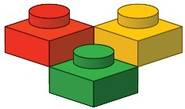

# 🧱 ShinyBricks

> **ShinyBricks** est une plateforme d'analyse *LEGO* qui permet d'étudier les prix de sets *LEGO* à leur sortie, leur prix actuel, l'évolution des thèmes, des informations sur les licences, etc.

<p align="center" width="100%">
  <a href="https://corentin-ducloux.shinyapps.io/ShinyBricks/">
    
  </a>
</p>


## La collecte des données : 


|                                                  | Source                                       | Méthode    | Données récoltées |
|--------------------------------------------------|----------------------------------------------|------------|-------------------|
| [](https://brickset.com/)         | [Brickset](https://brickset.com/)            | `API`      | Informations sur tous les sets |
| [](https://www.brickeconomy.com) | [Brickeconomy](https://www.brickeconomy.com) | `Scraping` | Prix actuel des sets |


La récupération des données c'est faite en deux temps : 
- Grâce au *wrapper* sur **R** développé par [Jason Bryer](https://github.com/jbryer/brickset), l'utilisation de l'API de **Brickset** a été encore plus simple. Ce qui nous à permis de construire une base de données relativement complète.
- À l'aide de cette base de données et du package [`httr2`](https://httr2.r-lib.org/), on a pu scraper le site **Brickeconomy** et ainsi récupérer les prix actuels (neuf/occasion) de chaque set LEGO®.

Les données extraites sont stockés sous format *.parquet* 🧱 et *.feather* 🪶.


## Application

**ShinyBricks** a été créée avec [`shiny`](https://shiny.posit.co/) et [`bslib`](https://rstudio.github.io/bslib/) ce qui nous a permis de créer une **UI** moderne.

Elle est accessible en cliquant [ici](https://corentin-ducloux.shinyapps.io/ShinyBricks/) ou sur le logo ci-dessus !

Pour le contenu de l'application, les graphiques ont été réalisés avec [`plotly`](https://plotly.com/r/) et les tableaux avec [`gt`](https://gt.rstudio.com/).

L'application contient plusieurs onglets ayant plusieurs fonctionnalités :
  - Une analyse par thème
  - Une analyse par an
  - Une analyse par set (caractéristiques, vue 3D, notices, avis...)
  - Un aperçu des stratégies de pricing adoptées

<details>
    <summary> 🎬 Démonstration </summary>
    <hr>
    
</details>

## Installation

Pour cloner le repos en premier lieu :
``` bash
git clone "https://github.com/CDucloux/ShinyBricksApp.git"
```

Puis dans votre console **R**:
``` r
shiny::runApp()
```

Ou directement depuis le terminal :

```shell
cd ~/ShinyBricksApp
Rscript.exe app.R
```
ou 
```shell
cd ~/ShinyBricksApp
Rscript app.R
```